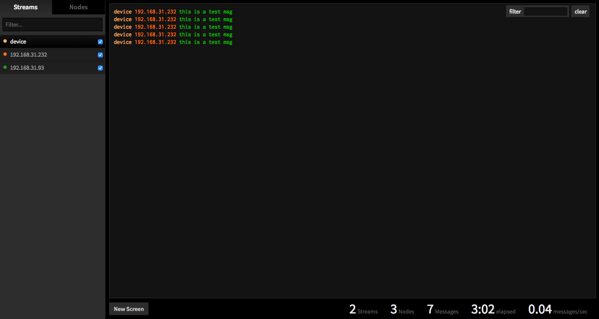

# browser.log.io - Real-time log in your browser 

you can send a log to browser.log.io server via HTTP.

Powered by [node.js](http://nodejs.org) + [socket.io](http://socket.io) + [Express](http://expressjs.com/)

## How does it work?

*Harvester* receives the log via HTTP（usually comes from a browser or webview）, send new log messages to the *server* via TCP, which broadcasts to *web clients* via socket.io.

Users browse streams and nodes in the web UI, and activate (stream, node) pairs to view and search log messages in screen widgets.

## preview



## Usage

1) Install via npm
    
    ```bash
    $ npm install -g browser.log.io
    ```

2) Run server

    ```bash
    $ browser.log.io-server
    ```

4) Run harvester

    ```bash
    $ browser.log.io-harvester
    ```

5) Browse to [http://localhost:28778](http://localhost:28778)

6) Send msg to port 8008

    ```javascript
    var data = {
        msg: JSON.stringify({data:[{name:'jake'},{name:'young'}]})
    };
    
    jsonp({
        url: 'http://harvester-ip:8008/log',
        data: data
    })
    ```

7) happy

## roadmap

第一步先完成基本功能，实现不一定是合理的，之后再视情况来优化和完善以及新增功能。

## License 

Copyright 2013 Linus Wang &lt;linus.wang.i77@gmail.com&gt;

Licensed under the Apache License, Version 2.0 (the "License");
you may not use this file except in compliance with the License.
You may obtain a copy of the License at

    http://www.apache.org/licenses/LICENSE-2.0

Unless required by applicable law or agreed to in writing, software
distributed under the License is distributed on an "AS IS" BASIS,
WITHOUT WARRANTIES OR CONDITIONS OF ANY KIND, either express or implied.
See the License for the specific language governing permissions and
limitations under the License.
